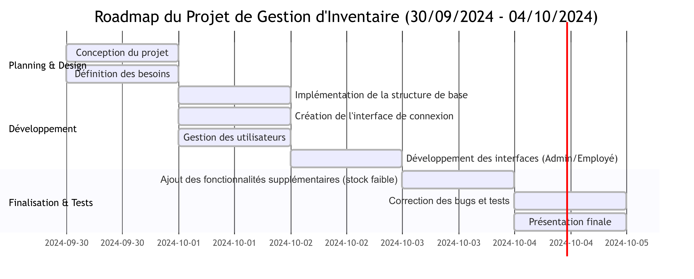

# Système de Gestion d'Inventaire

## Description
Ce projet est un système de gestion d'inventaire développé en Python avec une interface graphique utilisant Tkinter. L'application permet aux utilisateurs de gérer des produits, de suivre les stocks, et de générer des rapports sur les niveaux de stock.

## Fonctionnalités
- **Gestion des Produits** : Ajouter, supprimer et mettre à jour les produits de l'inventaire.
- **Rapports de Stock** : Générer des rapports sur les produits avec un stock faible.
- **Interface Utilisateur** : Interface graphique conviviale pour interagir avec le système.
- **Authentification** : Système de connexion pour les administrateurs et les employés.

## Arborescence des Fichiers
Voici l'arborescence des fichiers du projet :

```bash
gestion_inventaire/
├── gui/
│   ├── admin_interface.py     # Interface pour les administrateurs
│   ├── employee_interface.py   # Interface pour les employés
│   └── login_interface.py      # Interface de connexion
├── data/
│   ├── users.json             # Fichier JSON contenant les utilisateurs
│   └── inventory.json         # Fichier JSON contenant l'inventaire
├── reports/
│   └── stock_report.txt       # Rapport des produits avec un stock faible
└── inventory_manager.py        # Fichier principal pour gérer l'inventaire
```

## Utilisation

Lancez l'application :

```bash
py inventory_manager.py
```

Connectez-vous avec vos identifiants d'administrateur ou d'employé.
Gérez votre inventaire à partir de l'interface.

## Roadmap



## Auteurs
Chaouki Brahim - M10_white
